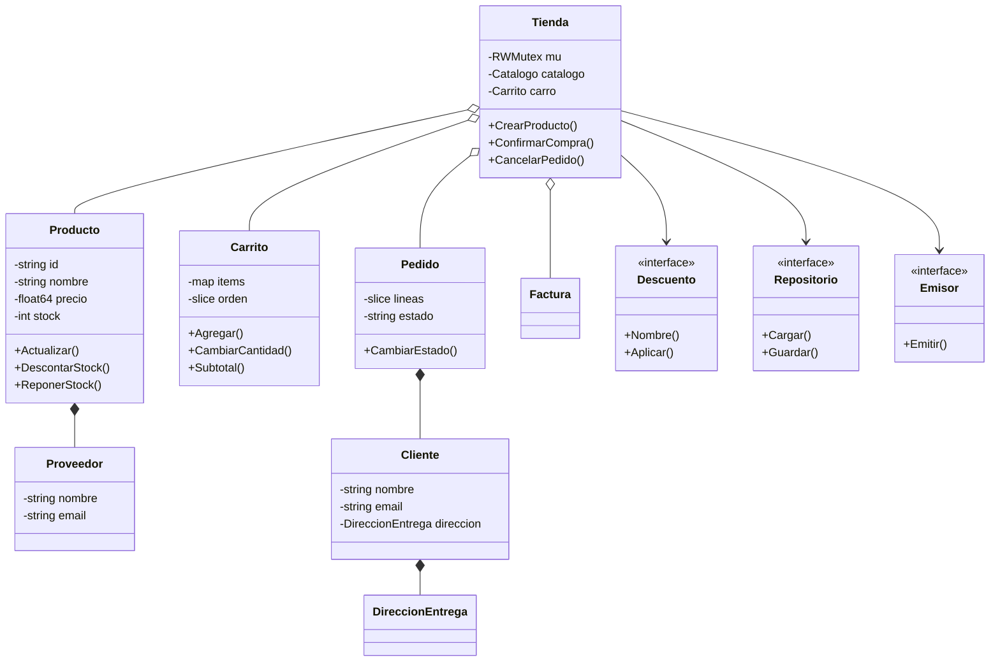

# Informe final — Sistema de gestión de e-commerce en Go

**Proyecto:** AudioCyber Store  
**Integrante:** Jorge Cano  
**Fecha:** 21 de agosto de 2026  
**Asignatura:** Programación Orientada a Objetos

## 1. Descripción y justificación

AudioCyber Store es una aplicación web de comercio electrónico orientada a productos tecnológicos. Su propósito es administrar el ciclo esencial de una compra: exhibir productos, controlar existencias, mantener un carrito, aplicar promociones, registrar clientes, confirmar pedidos y consultar comprobantes simulados.

El tema se seleccionó porque un e-commerce reúne problemas cercanos al entorno profesional y permite demostrar los contenidos de las cuatro unidades. Por ejemplo, un producto puede representarse con un struct encapsulado; el catálogo combina maps y slices; el descuento se modela mediante interfaces; la compra exige manejo de errores; y las solicitudes simultáneas requieren sincronización.

## 2. Objetivo general

Desarrollar un MVP web en Go que gestione de forma segura y persistente las operaciones principales de un e-commerce, aplicando POO, programación funcional, servicios REST, JSON, concurrencia y pruebas automatizadas.

### Objetivos específicos

1. Modelar entidades y reglas de negocio mediante structs, constructores y métodos.
2. Encapsular el estado interno y exponer operaciones validadas.
3. Implementar polimorfismo mediante interfaces de descuento, facturación y persistencia.
4. Publicar al menos ocho servicios REST con serialización JSON.
5. Conservar el estado en un archivo local mediante escritura atómica.
6. Atender solicitudes concurrentes sin carreras de datos.
7. Verificar el software con pruebas unitarias, de integración, aceptación y concurrencia.

## 3. Alcance

### Incluido en el MVP

- CRUD de productos y consulta de bajo stock.
- Búsqueda, carrito, cupones y checkout.
- Clientes, pedidos, estados y cancelación.
- Persistencia en JSON.
- API REST e interfaz web responsive.
- Factura académica simulada.
- Manejo uniforme de errores.
- Pruebas automatizadas y detector de carreras.

### Fuera de alcance

- Autenticación real de usuarios y roles.
- Pasarela bancaria o almacenamiento de tarjetas.
- Base de datos relacional y despliegue productivo.
- Firma electrónica, autorización o transmisión real al SRI.
- Envío real de correos y logística con transportistas.

## 4. Arquitectura y módulos

| Módulo | Responsabilidad |
|---|---|
| `modelo` | Entidades encapsuladas: producto, proveedor, cliente y dirección |
| `catalogo` | Map de productos, orden en slice, filtros y bajo stock |
| `carrito` | Ítems, cantidades, subtotales y operaciones del carrito |
| `promocion` | Estrategias polimórficas de descuento |
| `pedido` | Líneas inmutables, compra, estados y transiciones |
| `facturacion` | Comprobante simulado y desglose referencial de IVA |
| `persistencia` | Repositorio JSON con escritura atómica |
| `aplicacion` | Casos de uso y protección concurrente del estado |
| `webapi` | Rutas REST, DTO, middleware y archivos web embebidos |
| `cmd/web` | Configuración y ciclo de vida del servidor |

## 5. Diagrama de clases

Go no utiliza clases tradicionales ni herencia. El diagrama representa structs, composición e interfaces equivalentes al modelo POO aplicado.

## 6. Aplicación de POO y programación funcional

La encapsulación se aplica mediante campos no exportados. Un consumidor no puede asignar directamente un precio negativo o un estado arbitrario: debe llamar a constructores o métodos que validan la operación. Los receptores por valor se reservan para consultas; los receptores por puntero modifican stock, cantidades o estado.

Las interfaces `Descuento`, `FuenteCarrito`, `Buscador`, `Emisor` y `Repositorio` desacoplan las políticas de sus consumidores. De esta manera, `Pedido` no necesita conocer si el descuento es porcentual, y `Tienda` no necesita conocer cómo se guarda el estado.

El enfoque funcional aparece en funciones pequeñas y deterministas de transformación, cálculos que retornan nuevos valores, múltiples retornos `(valor, error)`, funciones como estrategias y el closure generador de identificadores conservado en la versión de consola.

## 7. Servicios web y JSON

El servidor utiliza `net/http` y rutas de Go 1.22. Se definieron 23 operaciones REST; superan el mínimo de ocho. Los request y response se modelan con DTO y struct tags JSON. La lectura se realiza directamente desde `r.Body` con `json.Decoder`, mientras que la respuesta se transmite con `json.Encoder`.

Los verbos utilizados son GET para consultar, POST para crear o ejecutar acciones, PUT para actualizar y DELETE para eliminar. Los errores se traducen a 400, 404, 409 o 500 según su naturaleza.

## 8. Concurrencia

El servidor HTTP inicia una goroutine por solicitud. Como el catálogo, el carrito y los pedidos utilizan maps y slices compartidos, un acceso concurrente sin coordinación provocaría data races o pérdida de actualizaciones.

La solución consiste en un `sync.RWMutex` dentro de `aplicacion.Tienda`. Las consultas utilizan `RLock`, permitiendo varias lecturas simultáneas. Las mutaciones utilizan `Lock`, de modo que la actualización del carrito, el stock y la persistencia se observan como una sección crítica.

La prueba `TestAPIConcurrenciaProtegida` envía 30 POST simultáneos al mismo producto. El resultado esperado es exactamente 30 unidades en el carrito. El test se ejecuta con `go test -race ./...`.

## 9. Persistencia

El repositorio `ArchivoJSON` implementa la interfaz de persistencia sin librerías externas. El archivo incluye versión, productos, carrito, cupón, clientes, pedidos, facturas y contador de pedidos.

Para reducir el riesgo de corrupción, el estado se escribe primero en un archivo temporal, se sincroniza con `Sync`, se cierra y finalmente se reemplaza el archivo anterior con `Rename`. Al arrancar, la aplicación restaura los objetos usando sus constructores, por lo que el JSON también pasa por las reglas del dominio.

## 10. Manejo de errores, seguridad y calidad

- Valores centinela identificables con `errors.Is`.
- Contexto agregado con `fmt.Errorf("...: %w", err)`.
- Rechazo de campos JSON desconocidos y de documentos múltiples.
- Cuerpo HTTP limitado a 1 MiB y persistencia limitada a 10 MiB.
- Timeouts del servidor y cierre ordenado ante señales.
- Validación de correo, longitudes, cantidad, precio y stock.
- Headers `nosniff`, `DENY`, política de referencia y CSP.
- Recuperación de pánicos sin exponer stack traces al cliente.
- Request ID y registro de duración por solicitud.
- Archivo de datos con permisos restringidos.

## 11. Facturación electrónica simulada

Como funcionalidad adicional, cada compra genera un comprobante con líneas, base imponible, IVA referencial, total y clave hash simulada. El total del pedido se interpreta como precio final con IVA incluido.

Esta función no debe confundirse con facturación electrónica real. En Ecuador, un comprobante válido requiere cumplir el esquema del SRI y usar firma electrónica. Por ese motivo, cada respuesta contiene la advertencia `FACTURA ACADÉMICA SIMULADA — SIN VALIDEZ TRIBUTARIA`.

## 12. Pruebas y resultados

| Tipo | Ejemplos | Resultado |
|---|---|---|
| Unitarias | producto, carrito, descuento, pedido, factura | Aprobado |
| Table-driven | actualización de producto y transiciones de estado | Aprobado |
| Persistencia | guardar, restaurar, permisos y JSON estricto | Aprobado |
| Integración | aplicación + repositorio y API + dominio | Aprobado |
| Aceptación | producto → carrito → cupón → pedido → factura | Aprobado |
| Concurrencia | 30 solicitudes simultáneas con `httptest` | Aprobado |
| Race detector | `go test -race ./...` | Aprobado |

Los casos, comandos y evidencias esperadas se detallan en [docs/PRUEBAS.md](docs/PRUEBAS.md).

## 13. Dificultades y aprendizaje

La dificultad principal fue evitar que la incorporación de HTTP y concurrencia rompiera las reglas del dominio. La solución fue mantener los handlers como adaptadores delgados y trasladar las operaciones a una capa de aplicación sincronizada. Otra dificultad fue persistir structs encapsulados; se resolvió usando DTO públicos y restaurando cada objeto mediante constructores validados.

El proyecto permitió comprobar que POO en Go se apoya más en composición, métodos e interfaces pequeñas que en jerarquías de herencia. También mostró que una aplicación correcta en ejecución secuencial puede fallar bajo concurrencia si sus maps y slices no se protegen.

## 14. Conclusión

El MVP cumple el propósito académico y funcional: integra las cuatro unidades, supera el mínimo de servicios web, conserva datos, demuestra concurrencia y cuenta con pruebas reproducibles. Su diseño permite sustituir el archivo JSON por una base de datos o el emisor simulado por una integración externa sin reescribir el dominio.

## 15. Referencias técnicas consultadas

- Material práctico de la semana 8: <https://github.com/carlosandresat/programacion-orientada-a-objetos-online/tree/master/w8>
- Paquete `net/http`: <https://pkg.go.dev/net/http>
- Paquete `encoding/json`: <https://pkg.go.dev/encoding/json>
- Paquete `net/http/httptest`: <https://pkg.go.dev/net/http/httptest>
- Facturación electrónica del SRI: <https://www.sri.gob.ec/facturacion-electronica>
- Información de IVA del SRI: <https://www.sri.gob.ec/impuesto-al-valor-agregado-iva>
