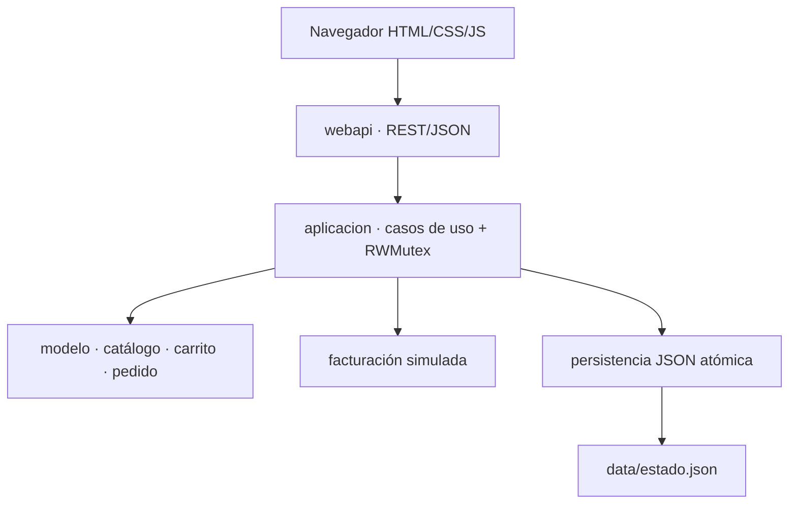

# 🛒 AudioCyber Store — e-commerce web en Go

Aplicación web académica desarrollada en **Go 1.22** como proyecto integrador de Programación Orientada a Objetos. Gestiona catálogo, inventario, carrito, cupones, clientes, pedidos y una factura electrónica **simulada**, y expone toda la operación mediante una API REST que serializa datos en JSON.

> La factura es exclusivamente demostrativa: **no tiene validez tributaria, no se firma electrónicamente y no se transmite al SRI**.

## Datos del proyecto

| Dato | Información |
|---|---|
| Integrante | Jorge Cano |
| Usuario de GitHub | `JCcoconut` |
| Asignatura | Programación Orientada a Objetos |
| Lenguaje | Go 1.22 |
| Fecha de cierre | 21 de agosto de 2026 |
| Aplicación seleccionada | Sistema de gestión de e-commerce |

## Objetivo

Construir un MVP de comercio electrónico que demuestre de forma integrada los conocimientos de las cuatro unidades: fundamentos y programación funcional, estructuras de datos y objetos, encapsulación e interfaces, y finalmente concurrencia, servicios web, JSON y pruebas automatizadas.

Se eligió un e-commerce porque permite representar problemas reales y verificables: actualización de inventario, cálculos de compra, reglas de descuento, persistencia, estados de pedido y atención concurrente de solicitudes HTTP.

## Funcionalidades principales

- Catálogo con búsqueda por nombre o categoría, consulta individual y alertas de bajo stock.
- Administración de productos: creación, actualización y eliminación controlada.
- Carrito con acumulación de cantidades, actualización, eliminación y cálculo de totales.
- Cupones `AUDIO10`, `GO15` y `UIDE20` implementados como estrategias polimórficas.
- Registro de clientes con dirección anidada y validaciones.
- Confirmación de pedidos con validación y descuento atómico del inventario.
- Estados `Confirmado → Enviado → Entregado` y cancelación con reposición de stock.
- Persistencia automática en `data/estado.json` mediante streams JSON y escritura atómica.
- API REST con más de 8 servicios web y respuestas normalizadas.
- Interfaz web responsive embebida dentro del ejecutable de Go.
- Concurrencia segura con `sync.RWMutex`; las peticiones HTTP son atendidas por goroutines.
- Factura académica simulada con base imponible, IVA referencial del 15 % y advertencia legal.
- Manejo de errores con valores centinela, `errors.Is`, wrapping con `%w` y códigos HTTP.
- Pruebas unitarias, de integración, aceptación, persistencia y concurrencia con `httptest`.

## Cómo ejecutar

Requisito: Go 1.22 o posterior.

```bash
git clone https://github.com/JCcoconut/sistema-ecommerce-go.git
cd sistema-ecommerce-go
go run ./cmd/web
```

Abra <http://localhost:8080> en el navegador. El archivo de persistencia se crea automáticamente en `data/estado.json`.

Variables opcionales:

```bash
PORT=9090 ECOMMERCE_DATA=data/mi-tienda.json go run ./cmd/web
```

La versión de consola del avance anterior continúa disponible:

```bash
go run ./cmd/tienda
```

## Verificación antes de entregar

```bash
gofmt -w .
go vet ./...
go test ./...
go test -race ./...
go build ./...
```

Resultado de la última verificación documentada: **todos los paquetes aprobaron `go test -race ./...`**.

## Arquitectura



La capa HTTP no modifica maps o slices directamente. Toda operación pasa por `aplicacion.Tienda`, que concentra las reglas transaccionales y protege el estado compartido.

## Estructura del repositorio

```text
sistema-ecommerce-go/
├── cmd/
│   ├── tienda/                 # Demo por consola de la Unidad 3
│   └── web/                    # Punto de entrada del servidor HTTP
├── internal/
│   ├── aplicacion/             # Casos de uso, DTO y coordinación concurrente
│   ├── carrito/                # Map + slice de ítems
│   ├── catalogo/               # Catálogo y búsquedas
│   ├── facturacion/            # Emisor e invoice simulados
│   ├── modelo/                 # Producto, proveedor, cliente y dirección
│   ├── pedido/                 # Pedido, líneas y estados
│   ├── persistencia/           # Repositorio JSON
│   ├── promocion/              # Interfaz de descuentos
│   └── webapi/                 # Rutas, handlers, middleware y frontend embebido
├── docs/                       # API, pruebas y visión futura
├── INFORME_FINAL.md
├── DEMO_VIDEO.md
└── go.mod
```

## Mapeo de conceptos por unidad

### Unidad 1 — Fundamentos y programación funcional

| Tema | Implementación |
|---|---|
| Variables, condicionales y bucles | Menú de consola, filtros, recorridos de catálogo y validaciones |
| Funciones y paquetes | Separación en paquetes `modelo`, `catalogo`, `carrito`, `pedido`, etc. |
| Múltiples retornos | Constructores y operaciones devuelven `(valor, error)` |
| Funciones como valores | La interfaz `Descuento` permite inyectar distintas reglas de cálculo |
| Closures | `pedido.NuevoGeneradorID` conserva un contador entre invocaciones |
| Funciones puras | Conversiones DTO, cálculo de subtotales y desglose simulado de IVA |

### Unidad 2 — Estructuras de datos y objetos

| Tema | Implementación |
|---|---|
| Arrays | Códigos y porcentajes iniciales fijos en el gestor de cupones |
| Slices y subslices | Orden del catálogo, líneas de pedido, historial y `Catalogo.Primeros` |
| Maps | Productos por ID, ítems del carrito, clientes, pedidos, facturas y cupones |
| Structs | `Producto`, `Proveedor`, `Cliente`, `Pedido`, `Factura` |
| Structs anidados | `Cliente` contiene `DireccionEntrega`; `Producto` contiene `Proveedor` |
| Constructores | `NuevoProducto`, `NuevoCliente`, `NuevoPedido`, `NuevaTienda` |
| Receptores por valor/puntero | Getters por valor; stock, cantidad y estados por puntero |

### Unidad 3 — POO en Go

| Tema | Implementación |
|---|---|
| Encapsulación | Campos privados; acceso mediante constructores, getters y métodos validados |
| Interfaces | `Descuento`, `FuenteCarrito`, `Buscador`, `Emisor`, `Repositorio` |
| Polimorfismo | `SinDescuento` y `Porcentaje` se intercambian sin modificar pedidos |
| Manejo de errores | Errores centinela, `errors.Is`, `%w`, validaciones y respuestas HTTP coherentes |
| Objetos y composición | El agregado `Tienda` coordina objetos sin exponer sus colecciones internas |

### Unidad 4 — Concurrencia, web, JSON y testing

| Tema | Implementación |
|---|---|
| Servidor HTTP | `net/http`, `http.Server`, `ServeMux` y rutas modernas de Go 1.22 |
| REST | Recursos, verbos GET/POST/PUT/DELETE y códigos 200/201/204/400/404/409/500 |
| JSON | Struct tags, `Encoder`/`Decoder`, streams y campos desconocidos rechazados |
| Concurrencia | Peticiones en goroutines y estado protegido con `sync.RWMutex` |
| Testing | `testing`, table-driven tests, `httptest` y prueba de aceptación |
| Race detector | 30 peticiones concurrentes sobre el mismo carrito verificadas con `-race` |

## Servicios web

La API contiene **23 operaciones** agrupadas en catálogo, carrito, clientes, pedidos y facturas. Algunos ejemplos:

| Método | Ruta | Función |
|---|---|---|
| GET | `/api/health` | Estado del servidor |
| GET / POST | `/api/productos` | Listar/buscar o crear productos |
| GET / PUT / DELETE | `/api/productos/{id}` | Consultar, actualizar o eliminar |
| GET | `/api/productos/bajo-stock?limite=5` | Alerta de inventario |
| GET | `/api/carrito` | Consultar carrito y totales |
| POST | `/api/carrito/items` | Agregar producto |
| PUT / DELETE | `/api/carrito/items/{id}` | Cambiar cantidad o retirar |
| POST | `/api/carrito/cupon` | Aplicar cupón |
| GET / POST | `/api/clientes` | Listar o registrar clientes |
| GET / POST | `/api/pedidos` | Listar o confirmar pedido |
| PUT | `/api/pedidos/{id}/estado` | Avanzar estado |
| POST | `/api/pedidos/{id}/cancelar` | Cancelar y reponer stock |
| GET | `/api/facturas/{id}` | Consultar factura simulada |

La referencia completa y ejemplos `curl` están en [docs/API.md](docs/API.md).

## Persistencia y seguridad

- Archivo JSON con permisos `0600` y directorio con `0700`.
- Escritura en archivo temporal, `Sync`, cierre y `Rename` para evitar archivos parciales.
- Límite de 10 MiB al cargar persistencia y 1 MiB por cuerpo HTTP.
- JSON estricto con `DisallowUnknownFields`.
- Timeouts de lectura, escritura, headers e inactividad.
- Middleware de recuperación de pánicos, request ID, logging y headers de seguridad.
- Validación de correos con `net/mail`, longitudes, precios, cantidades y stock.
- No se almacenan contraseñas, tarjetas ni datos bancarios.
- No se habilita CORS global; la interfaz web y la API comparten origen.

## Documentación de entrega

- [Informe final](INFORME_FINAL.md)
- [Servicios REST](docs/API.md)
- [Plan, evidencias y resultados de pruebas](docs/PRUEBAS.md)
- [Guion para la demostración en video](DEMO_VIDEO.md)
- [Visualización del futuro](docs/VISION_FUTURO.md)
- [Guía para publicar el proyecto en GitHub](GUIA_GITHUB_FINAL.md)

## Dependencias

No se utilizan paquetes de terceros. Todo el proyecto se construye con la biblioteca estándar de Go, principalmente: `net/http`, `encoding/json`, `sync`, `testing`, `net/http/httptest`, `errors`, `os`, `io`, `time` y `crypto/sha256`.

Esta decisión reduce la complejidad de instalación y permite relacionar directamente el código con los temas revisados en clase.
