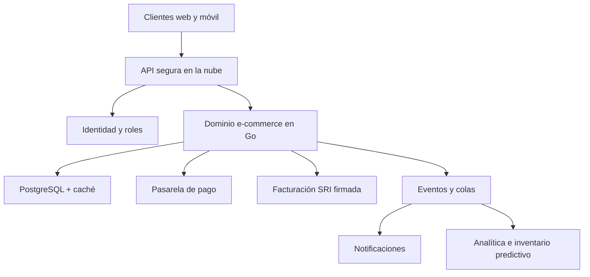

# Visualización del futuro

## Idea central

La versión académica demuestra el núcleo de negocio. Una evolución real conservaría ese dominio, pero reemplazaría adaptadores locales por servicios productivos, observables y escalables.

## Conceptos representados

- **Omnicanalidad:** una misma API atiende web y aplicaciones móviles.
- **Escalabilidad:** una base de datos transaccional y caché sustituyen el archivo JSON.
- **Seguridad:** autenticación, autorización, gestión de secretos y auditoría.
- **Integraciones:** pagos, logística y comprobantes electrónicos autorizados.
- **Arquitectura orientada a eventos:** la compra publica eventos sin bloquear al usuario.
- **Analítica:** predicción de demanda y alertas de inventario basadas en datos.
- **Observabilidad:** métricas, trazas y logs permiten detectar fallas y medir experiencia.

## Reflexión

La tecnología seleccionada no busca añadir complejidad por moda. Cada componente futuro responde a una limitación comprobable del MVP: el archivo JSON no escala entre instancias, el comprobante simulado no tiene validez legal y la aplicación no diferencia identidades ni permisos. La ventaja de la arquitectura actual es que esas piezas pueden sustituirse mediante interfaces sin abandonar las reglas ya probadas.
